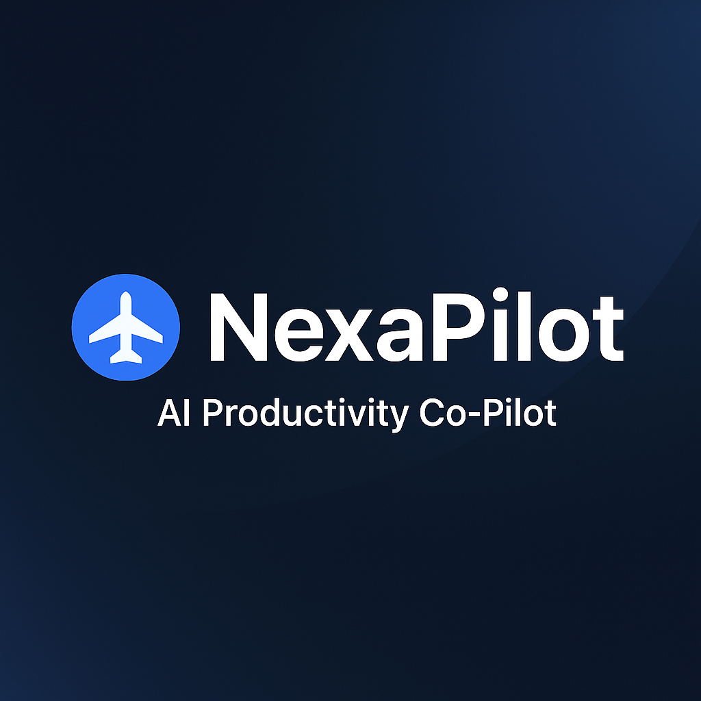
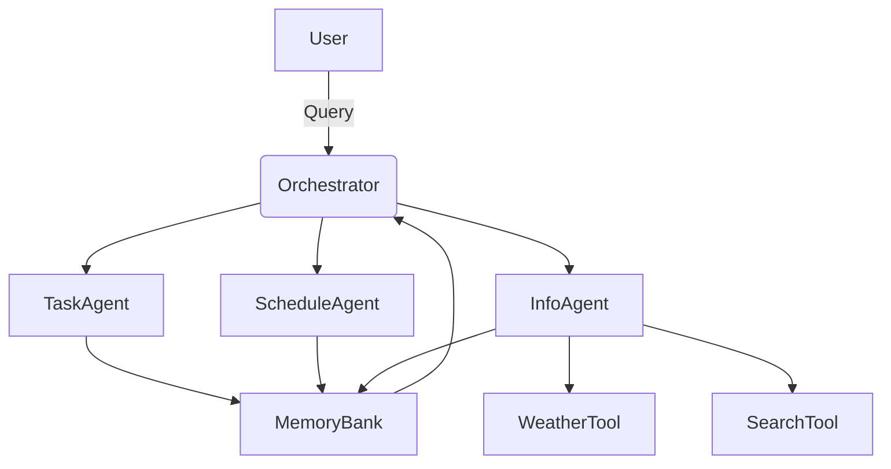

# 🚀 NexaPilot — AI Productivity Co-Pilot
*A Multi-Agent Intelligent Assistant for Daily Productivity*

<p align="center">
  
</p>
---

## ✨ Overview

**NexaPilot** is an AI-powered personal productivity assistant built using a **multi-agent architecture**, enabling intelligent task management, automated planning, weather insights, and natural conversational interaction.

It includes:

- 🌐 A fully responsive **Web UI**
- ⌨️ A command-line **CLI interface**
- 🧠 Multi-agent orchestration
- 🔧 Real tools (Weather + Search)
- 🎙 Voice input (Web Speech API)
- 🌓 Light & Dark Mode UI

---

## 🧠 Multi-Agent System

| Agent | Description |
|-------|-------------|
| **TaskAgent** | Creates, lists, prioritizes, and completes tasks |
| **ScheduleAgent** | Generates smart, time-blocked daily schedules |
| **InfoAgent** | Weather-based advice + basic search insights |
| **Orchestrator** | Understands user intent and routes the request |

Supporting Tools:

- 🌤 WeatherTool
- 🔍 SearchTool
- 💾 MemoryBank
- 🗂 SessionManager

---

## 🏗 Architecture



---

## 💻 Web Interface Features

- Modern glass-design chat interface  
- Smooth animations  
- Fully responsive (desktop, tablet, mobile)  
- Slide-in sidebar & task drawer  
- Dark/Light mode  
- Floating Action Button (FAB)  
- Voice input support  

---

## 📂 Project Structure

```
NexaPilot/
│
├── main.py
├── orchestrator.py
├── .env (ignored)
│
├── agents/
│   ├── task_agent.py
│   ├── schedule_agent.py
│   └── info_agent.py
│
├── tools/
│   ├── weather_tool.py
│   └── search_tool.py
│
├── memory/
│   ├── memory_bank.py
│   └── session_manager.py
│
├── web/
│   ├── ui.py
│   ├── static/
│   │   ├── chat.css
│   │   ├── chat.js
│   │   ├── logo2.png
│   └── templates/
│       └── chat.html
│
└── evaluation/
    └── evaluate_agents.py
```

---

## 🔧 Installation

### 1️⃣ Install dependencies
```
pip install -r requirements.txt
```

### 2️⃣ Add your API key
Create `.env` file:
```
GOOGLE_API_KEY=your_api_key_here
```

---

## ▶️ How to Run

### 🌐 Web UI
```
python -m web.ui
```
Open:  
`http://127.0.0.1:5000/chat`

### 🖥 CLI Mode
```
python main.py
```

---

## 🤝 Contributing
Contributions are welcome!

---

## 📜 License
MIT License
